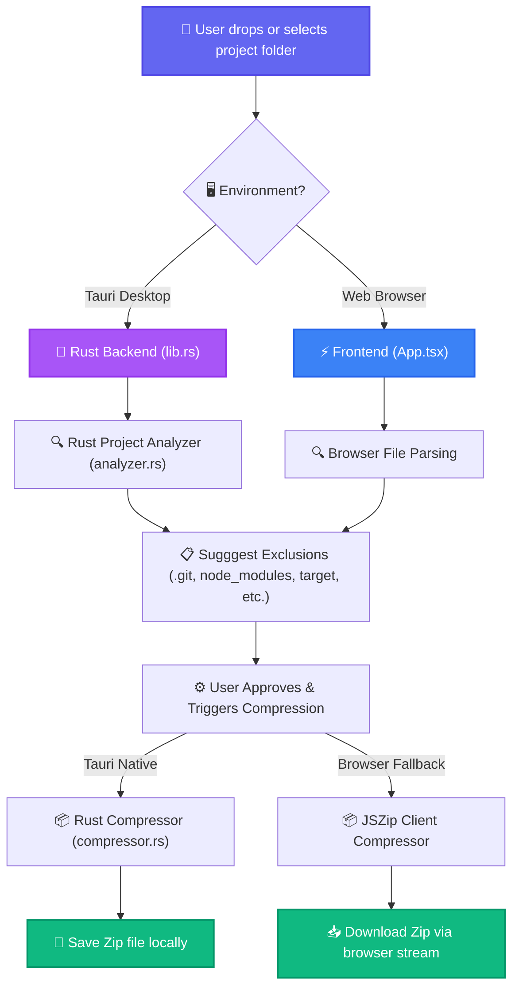

<p align="center">
  
</p>

<p align="center">
  
  
  
  
  
</p>

---

<p align="center">
  <b>DeveloperZip</b> is an intelligent, high-performance project packager built for developers. Running natively as a desktop application with <b>Tauri v2</b> and <b>Rust</b>, it analyzes project directories (supporting Node.js, Rust, Python, Java, and more), automatically filters heavy, unnecessary dependency folders (like <code>node_modules</code>, <code>target</code>, <code>venv</code>), and compresses your code instantly.
</p>

---

## 🚀 Key Features

*   **⚡ Native Rust Speed:** Lightning-fast ZIP compression powered by a high-performance Rust backend.
*   **🧠 Intelligent Project Detection:** Auto-detects project environments (React, Rust, Python, Java) and recommends smart file exclusions.
*   **🌐 Dual Run Options:** Works in native desktop environments (Tauri API invocation) as well as modern browser fallbacks (JSZip-based client-side compression).
*   **🎨 Glassmorphic UI:** A beautiful, responsive user interface built using Vite, Tailwind CSS, Framer Motion, and Lucide icons.
*   **🤖 Daily Green Streak:** Automated GitHub Actions workflow to run a scheduled cron job and keep your contributions active daily.

---

## 🛠️ Architecture Workflow

The diagram below outlines the flow of the **DeveloperZip** system, from directory selection to smart analysis and final package output.



---

## 💻 Tech Stack

| Component | Technology | Description |
| :--- | :--- | :--- |
| **Frontend** | React 18 & TypeScript | Core UI structure, custom logic, and states. |
| **Styling** | Tailwind CSS | Sleek glassmorphism and modern layouts. |
| **Animations** | Framer Motion | Smooth component transitions and dragging interactions. |
| **Backend** | Rust & Tauri v2 | Direct system interactions, directory analyzer, and compression engine. |
| **Workflows** | GitHub Actions | Handles automated commits and repository updates. |

---

## ⚡ Setup & Installation

### Prerequisites
Make sure you have Node.js and Rust installed on your computer.

```bash
# Clone the repository
git clone https://github.com/YashwanthNavari/DeveloperZip-Intelligent-Project-Packaging-for-Software-Developers.git

# Navigate into the project folder
cd DeveloperZip-Intelligent-Project-Packaging-for-Software-Developers

# Install Node dependencies
npm install
```

### Development
To launch the application in development mode with hot-reloading:

```bash
# To run Vite web client fallback
npm run dev

# To run Tauri desktop app wrapper
npm run tauri dev
```

### Production Build
To package the app for production:

```bash
# Build desktop executable binaries
npm run tauri build
```

---

## 📅 Daily Green Streak Action
This repository contains a specialized GitHub Actions workflow configured to run on a daily cron schedule at **00:00 UTC**. 

### How it works:
1. Every night, GitHub triggers the `.github/workflows/daily-commit.yml` action.
2. The runner checks out your repository, modifies `daily_activity.txt` with a fresh timezone-accurate timestamp, and pushes the change back to the repository.
3. This ensures that you have a **continuous commit history** on your profile every single day without needing to manually run anything or keep your computer open.

To run it manually for testing, navigate to your repository's **Actions** tab on GitHub, select **Automated Daily Commit**, and click **Run workflow**.

---

<p align="center">
  Made with 💜 by Yashwanth Navari & Antigravity AI Pair Programmer
</p>
